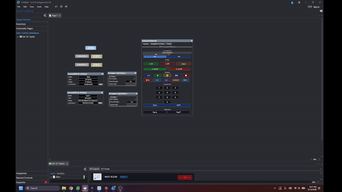

# Q-SYS Master Touch Panel UI Controller

A dynamic, intelligent UI driver for Q-SYS that seamlessly manages state, layer visibility, and routing across single-room and combinable multi-room topologies.

This plugin replaces static page navigation with a robust, code-driven state machine. It guarantees perfectly synchronized Touch Panel user interfaces across any hardware configuration by leveraging the native `Uci.SetLayerVisibility` and `Uci.SetSharedLayerVisibility` API.

## Features
- **Dynamic Topology Parsing:** Automatically adjusts UI layers based on physical wall sensors to merge or separate room controls.
- **Robust State Machine:** Centralized System Power, Startup, and Shutdown logic synced seamlessly across multiple touch panels.
- **Auto-Wake Engine:** Intelligently boots the system if a user attempts to interact with local source routing while the system is asleep.
- **Standalone Mode Support:** Leave the `Room Association` property blank to automatically bypass all topology suffixing for clean, single-room configurations.

## How to Use

1. **Install the Plugin:** Drag `Master_Touch_Panel_UI_Controller.qplug` into your Q-SYS design.
2. **Configure Properties:** 
   - Enter your target UCI Name and the base Page Name (e.g., `Main`).
   - For standalone rooms, you can safely leave the `Room Association` property **blank**.
   - For combinable multi-room systems, set `Room Association` to the room's unique letter (`A`, `B`, `C`).
3. **Automatic Target Loading:** Connect your core to emulation or live mode. The plugin automatically scans your UCI and populates the dropdown menus with all valid layers.
4. **Assign Targets:** Use the dropdown ComboBoxes within the plugin to assign your Base Pages, Subpages, Popups, and Navigation overlays.
5. **Multi-Room Sync:** If you are building a combinable system, you **must** set the plugin's Code Name to `UI_Controller_A` (matching its room letter) and check **Script Access**. This allows adjacent controllers to discover each other via RPC to synchronize power states globally.

## Recent Updates

- **v7.2.9.23 (Current):** 
  - Automated the UI target scraping; the 'Pull Live UCI Targets' manual button has been deprecated and removed.
  - Refactored Power and Preset event handlers to bypass a recursive trigger exception in the Q-SYS runtime engine, enabling flawless execution of full startup and shutdown sequences directly from UI pins.
  - Hardened the `append_suffix` algorithm to strictly bypass appending `-A` room suffixes when `Number of Walls` is set to `0`.
  - Migrated `Start Page` and `Shutdown Page` configurations from static properties to dynamic ComboBoxes that integrate fully with the UCI Target Scraper.
  - Eliminated UI "bounce" and button-latching conflicts by harmonizing `sys_state` triggers with Q-SYS native toggle behaviors.
